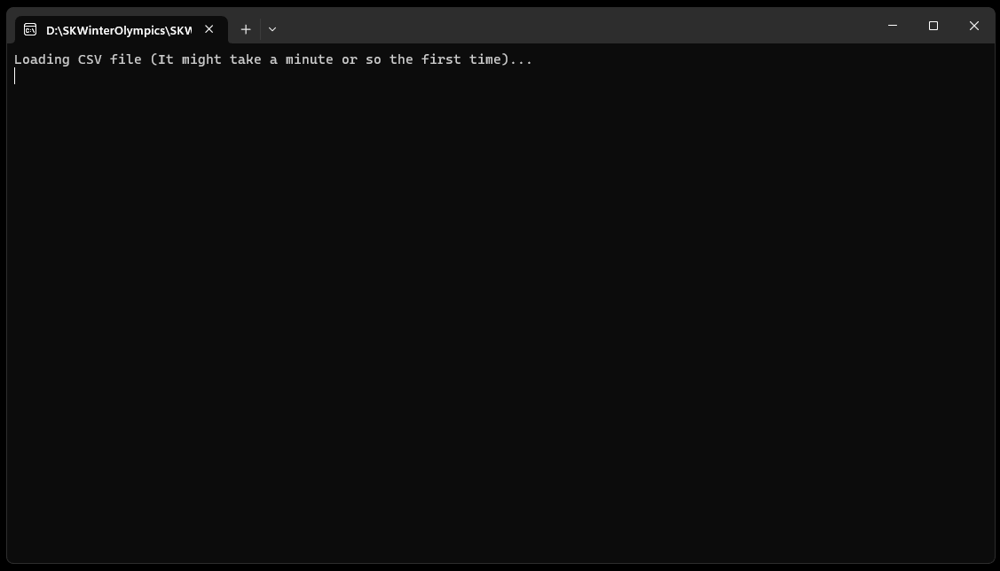

# Semantic Kernel Winter Olympics

This example is a conversion of the Python example found [here](https://github.com/openai/openai-cookbook/blob/main/examples/Question_answering_using_embeddings.ipynb?ref=mlq.ai).

The example downloads a large CSV file (213Mb) containing questions and answers about the Winter Olympics. 
It then uses the Semantic Kernel to find the most relevant answer to a given question.

[](http://google.com.au/)

## Running the example

To run the example, you need to have a valid OpenAI API key.

Make sure the user secrets are populated with the following entry:
```
"SemanticKernel:ApiKey": "sk-123456..."
```

## The code

Program.cs begins by loading the configuration.

```csharp
// -------------- Setup dependency injection --------------
var config = new ConfigurationBuilder()
    .AddJsonFile("appsettings.json")
    .AddUserSecrets(Assembly.GetExecutingAssembly())
    .Build();

var serviceProvider = new ServiceCollection()
    .AddSKWinterOlympics(config)
    .BuildServiceProvider();

var options = serviceProvider.GetRequiredService<IOptions<SemanticKernelOptions>>().Value;
options.Validate(); // Make sure to provide an OpenAI API key in user secrets.
```

It will then download the CSV file (if it is not already present on disk) and instantiate an IMemoryStore to hold the data.

The file will be saved under bin\Debug\net7.0\TestData and it's about 213Mb in size.

```csharp
// -------------- Load the CSV into the memory store --------------
var memoryStore = serviceProvider.GetRequiredService<IMemoryStore>();
var csvLoader = serviceProvider.GetRequiredService<CsvLoader>();

csvLoader.MemoryRecordLoaded += (index, rec) =>
{ 
    if (index % 1000==0)
        Console.WriteLine($"Loaded {index} memory records...");
};
Console.WriteLine("Loading CSV file (It might take a minute or so the first time)...");

const string CollectionName = "winterOlympics";

await csvLoader.InitializeAsync(CollectionName);

// Creates a semantic text memory. We'll use use this below to find semantic matches
OpenAITextEmbeddingGeneration gen = new(options.EmbeddingModel, options.ApiKey);
ISemanticTextMemory memory = new SemanticTextMemory(memoryStore, gen);
```

Once the above is complete, it will ask the user to enter a question and it will find the most relevant answer by using IMemoryStore.
If the user does not enter a question, the application will pick the next pre-configured question to ask.

These are the questions that are currently configured:

```csharp
// -------------- Running app --------------
var predefinedQuestions = new[] {
    "Which athletes won the gold medal in curling at the 2022 Winter Olympics?",
    "who winned gold metals in kurling at the olimpics",  // misspelled question
    "How many records were set at the 2022 Winter Olympics?", // counting question
    "Did Jamaica or Cuba have more athletes at the 2022 Winter Olympics?", // comparison question
    "What is 2+2?", // question outside of the scope
    "Which Olympic sport is the most entertaining?", // subjective question
    "Who won the gold medal in curling at the 2018 Winter Olympics?" // question outside of the scope  
};
```

Once the question is set, it's time to lookup relevant values in IMemoryStore.
The code will generate a string (semanticMatches) containing the matched information.

```csharp
// Looks for semantic matches in the local data
var id = 0;
var semanticMatches = string.Empty;
await foreach (var localMatch in memory.SearchAsync(CollectionName, question, limit: 5))
{
    Console.WriteLine($"Semantic result #{id++}, Relevance: {localMatch.Relevance}.");
    semanticMatches += $"\n\nWikipedia article section:\n{localMatch.Metadata.Text}\n";
}
```

Now that we have the local information assembled, we can ask OpenAI to find the most relevant answer to the question.

```csharp
// Ask the question using the semantic matches as context
IChatCompletion chatCompletion = new OpenAIChatCompletion(options.Model, options.ApiKey);
ChatHistory newChat = chatCompletion.CreateNewChat(instructions: "You answer questions about the 2022 Winter Olympics.");

var ask = "Use the below articles on the 2022 Winter Olympics to answer the subsequent question. " +
           "If the answer cannot be found in the articles, write 'I could not find an answer.'\n" +
           semanticMatches + '\n' +
           $"Question: {question}";

newChat.AddMessage(ChatHistory.AuthorRoles.User, ask);

string response = await chatCompletion.GenerateMessageAsync(newChat, new ChatRequestSettings
{
    Temperature = 0
});

Console.WriteLine("------------------------------------------------------");
Console.ForegroundColor = ConsoleColor.Cyan;
Console.WriteLine($"QUESTION: {question}");
Console.ForegroundColor = ConsoleColor.Yellow;
Console.WriteLine($"RESPONSE: {response}");
//Console.WriteLine($"SEMANTIC MATCHES:\n{semanticMatches}");
Console.WriteLine("------------------------------------------------------");   
Console.ForegroundColor = defColor; 
```
